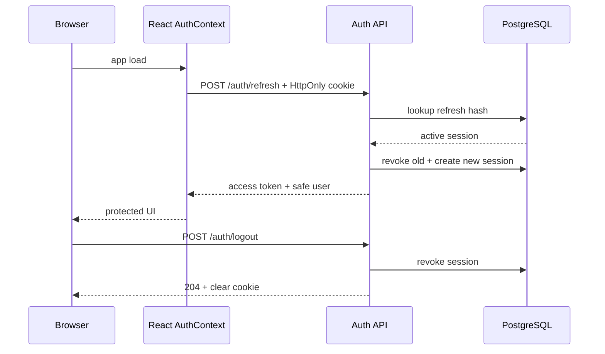

# Authentication flow

1. Register or login is submitted to the API.
2. Zod validates the payload and password complexity.
3. The server hashes passwords with bcrypt and never stores plaintext passwords.
4. A shared User row is created with STUDENT or COMPANY role plus its profile.
5. A random refresh secret is generated; only its SHA-256 hash is stored in RefreshToken.
6. The raw refresh secret is sent as an HttpOnly cookie.
7. A short-lived JWT access token (15 minutes by default) is returned in JSON.
8. The React AuthContext keeps the access token in memory.
9. Protected requests use Authorization: Bearer <access-token>.
10. On app load, AuthContext calls POST /api/auth/refresh with credentials included.
11. The server validates expiry/revocation and rotates the refresh session.
12. A new access token and refresh cookie are returned.
13. If refresh fails, ProtectedRoute redirects the user to /login.
14. Logout revokes the refresh row server-side and clears the cookie.
15. Replaying a revoked refresh secret therefore cannot mint another access token.

## Sequence diagram

